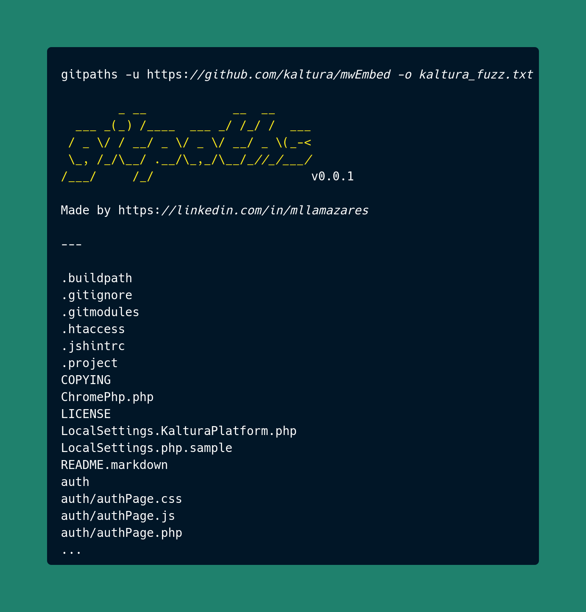

# gitpaths


[](https://www.linkedin.com/in/mllamazares/)
[](https://github.com/mllamazares/gitpaths/watchers)
[](https://github.com/mllamazares/gitpaths/stargazers)
[](https://twitter.com/intent/tweet?text=Check%20out%20gitpaths%21%20https%3A%2F%2Fgithub.com%2Fmllamazares%2Fgitpaths)

`gitpaths` is a lightweight tool written in Go that retrieves the folder structure of a GitHub repository without needing to clone it, making it easier to create custom wordlists for fuzzing. Check out the [sample workflow](#sample-workflow).



## Features

- Fetches file paths from a repository using the GitHub API. 🔭
- Supports specifying a branch within the target repository. 🎯
- Minimal dependencies and lightweight. 🪶
- Blazing fast! 🚀

## Installation

`gitpaths` requires Go 1.21 or later to install successfully. Simply run the following command to get it:

```bash
go install -v github.com/mllamazares/gitpaths@latest
```

## Usage

```bash
gitpaths -h
```

This will display help for the tool. Here are all the parameters it supports:

```
Usage of gitpaths:
  -u string
    	GitHub repository URL
  -b string
    	Branch name (optional) (default "master")
  -o string
    	Output file (optional)
  -silent
    	Omit sysout printing
  -h	Display help
```

### Sample Workflow

1. Use a tool like Wappalyzer, httpx, nuclei, or whatweb to detect the specific tech stack of the target endpoint, such as a CRM, CMS, or WordPress plugin.
2. Google the corresponding GitHub repository (and specific branch, if applicable).
3. Create a custom wordlist: `gitpaths -u https://github.com/example/pluginXYZ -b version2.1.23 -o pluginXYZ_wordlist.txt`
4. Finally, use your favorite fuzzing tool with that wordlist to test which endpoints are reachable on your target: `ffuf -u https://target.com/plugins/FUZZ -w pluginXYZ_wordlist.txt`

## TODO
- [ ] Auto-detect technology and GitHub repo.
- [ ] Accept GitHub token to avoid rate limiting so it can be run at scale. 
- [ ] Mix with `ffuf` for an end-to-end fuzzing experience.
- [ ] Clean and refactor code.

Feel free to send a PR! 🙌